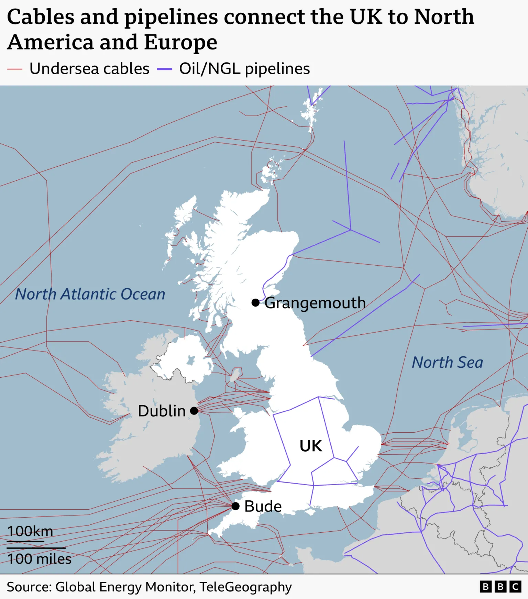
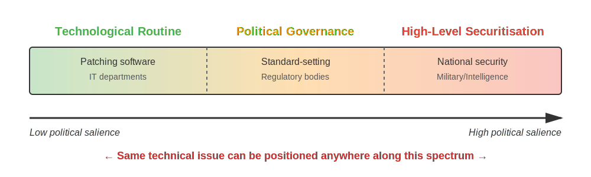
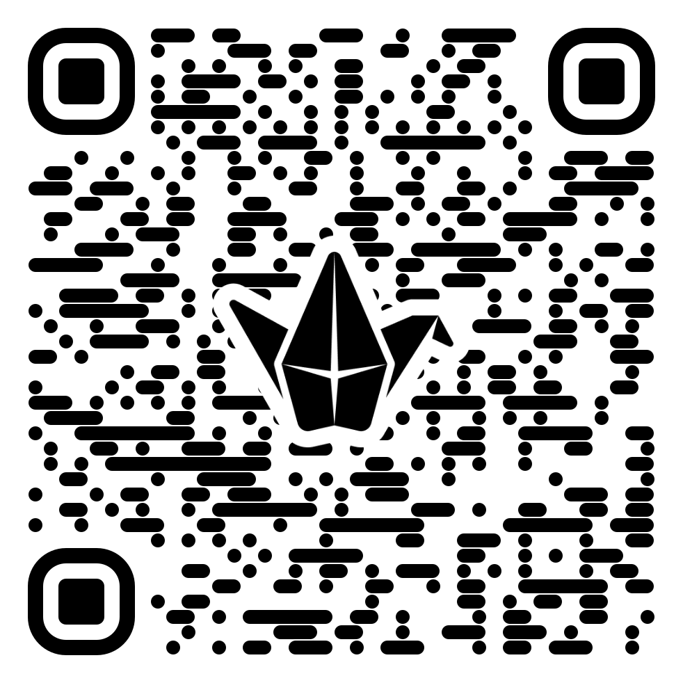
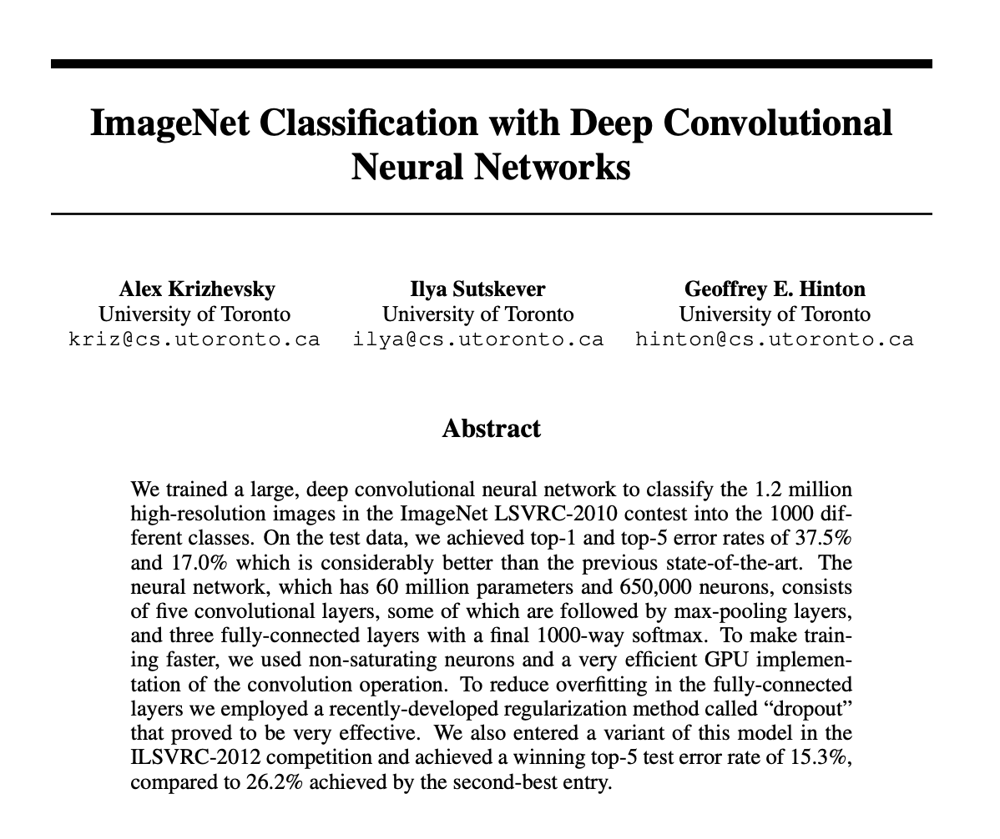
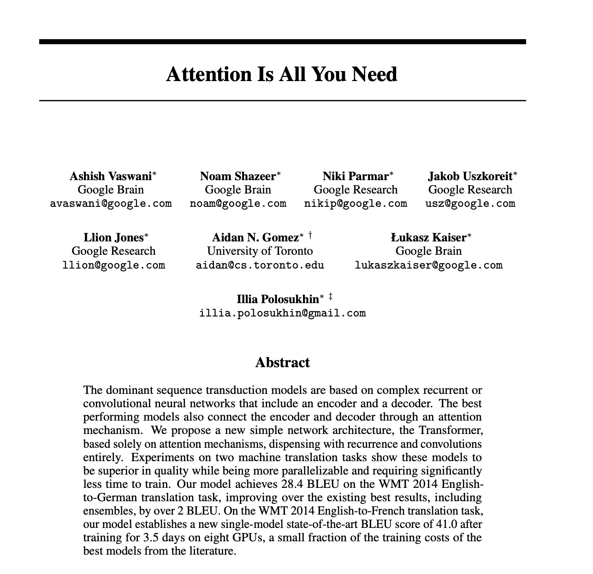

## Acknowledgement of Country

I would like to acknowledge the Traditional Owners of Australia and recognise their continuing connection to land, water and culture. The University of Sydney is located on the land of the Gadigal people of the Eora Nation. I pay my respects to their Elders, past and present.

---

## Crisis Simulation — Next Week, same time and place of your lecture {.smaller}

- **In-class role-playing exercise** — you respond to a fictional international cyber crisis as a real-world stakeholder

- Two phases (~40 min each), plus debrief

- Worth **5% of your final grade** (in-person attendance + active participation)

- Feeds directly into the **Analytical Essay (30%)**, due Week 9

## Find Your Groups on Canvas

You have been assigned to **two** groups:

1. **World** — your self-contained simulation universe (e.g. Alpha, Bravo, Charlie…)

2. **Stakeholder** — the organisation you represent (e.g. a government, the UN, a corporation…)

To find them: **Canvas → People → Groups**, then check the tabs *Crisis Simulation – Worlds* and *Crisis Simulation – Stakeholders*.

Your **role** and **world contacts** (UniKeys) are on the *Stakeholders and Roles* page inside your World group.

## What You Need to Do Before the Session {.smaller}

1. **Read the Pre-Simulation Brief** (on Canvas, Week 08 Module) — and the **Stakeholder Profiles** published this week on Canvas

2. **Install Signal** on your phone or computer

3. **Make first contact** — use the UniKeys on Canvas to email your group members via Outlook, then exchange Signal usernames (and check your email they might have contacted already!)

4. **Coordinate across groups** — try to get Signal contacts for representatives of the other five stakeholder groups in your world

5. **Review relevant readings**

## What to Bring

- **Laptop or tablet with keyboard** (strongly recommended for notetaking and communication)

- Phone is fine for Zoom and Signal

- Be ready to join the **Zoom session** (link on Canvas) — at least one group member must be on Zoom at all times

## On the Day — Structure {.smaller}

| Time | What happens |
|------|------|
| T+0 | All in lecture hall — intro and logistics |
| T+5 | Groups disperse; **Information Drop 1** shared via Zoom |
| T+5 – T+45 | **Phase 1** — analyse, strategise, negotiate (40 min) |
| T+45 | **Information Drop 2** shared via Zoom — situation escalates |
| T+45 – T+85 | **Phase 2** — respond to new developments, continue negotiations (40 min) |
| T+85 – T+100 | **Debrief** — all return to lecture hall |

## Communication Channels

**Zoom** — staff broadcasts only (info drops, announcements, Q&A with staff but only about logistical problems!)

- Keep it open throughout; submit questions via Zoom chat

**Signal** — inter-group negotiation within your world only

- Do **not** contact groups from other worlds

- Staff do not participate on Signal

## Take Notes!

Your simulation experience is the foundation for the **Analytical Essay (30%)**.

Document:

- Key decisions your group made (and why)
- Negotiations with other groups
- Moments of disagreement or uncertainty
- How your stakeholder's interests shaped your choices

## Questions?

Stakeholder profiles have been published on Canvas this week.

If you have questions about logistics or group assignments, ask now or email Francesco.


# Opening: A Story from This Week

## "We See You": UK Tracks Russian Submarines

{width="85%" fig-align="center"}


::: footer
Source: BBC News, 10 April 2026
:::

## What Happened?

**Last week**: Three Russian submarines conducted a "covert" operation over undersea cables and pipelines north of the UK

**UK Response**:

-   Deployed HMS St Albans (frigate), RFA Tidespring (tanker), and anti-submarine helicopters
-   Tracked all three Russian submarines continuously
-   Dropped sonar buoys to demonstrate monitoring

**Defence Secretary John Healey** addressed Putin directly:

> "We see you. We see your activity over our cables and our pipelines... any attempt to damage them will not be tolerated and will have serious consequences."


::: footer
BBC News, 10 April 2026
:::

## The Russian Operation: GUGI

**Three submarines involved:**

-   One **Akula-class attack submarine** (diversionary tactic)
-   Two **GUGI spy submarines** (actual surveillance)

**What is GUGI?**

-   Main Directorate for Deep Sea Research (*Glavnoye upravlenie glubokovodnikh issledovanii*)
-   Reports directly to Russian defence minister and president
-   Specialises in underwater surveillance, sabotage, and reconnaissance
-   Can deploy mini-submarines to cut cables or monitor data passing through them

**The concern**: Russia may be mapping infrastructure to disrupt in case of future conflict


## Why Do Undersea Cables Matter?

**The UK's dependence on undersea infrastructure:**

-   **~60 undersea cables** come ashore at various points (particularly East Anglia and South West England)
-   **More than 90%** of UK's day-to-day internet traffic travels via these cables
-   **77%** of UK's gas imports come from Norway through undersea pipelines
-   The **Langeled pipeline** alone is 724 miles (1,166km) long

**Global scale:**

-   More than 600 undersea cables worldwide
-   870,000 miles (1.4m km) of cables carrying electricity and information
-   Connect entire continents


## From Mundane Technology to Geopolitical Flashpoint

::: {.callout-important}
### The Core Insight

**Undersea cables** are routine telecommunications technology

BUT they become:

-   Sites of **strategic competition** between major powers
-   Targets for **surveillance and potential sabotage**
-   Objects of **sovereignty claims** and jurisdiction disputes
-   Critical to **national security** and economic survival
-   Arenas for **hybrid warfare** below the threshold of armed conflict
:::

**This is what we mean by "the geopolitics of cybersecurity"**


# Welcome to Part 2

## Transitioning from Technology to Politics

::: {.columns}
::: {.column width="100%"}
**Part 1 (Weeks 1-6): The Technical Foundations**

-   How computers and networks work
-   Cryptography and security mechanisms
-   Vulnerabilities and exploits
-   Defence techniques

**Part 2 (Weeks 7-13): The Political Landscape**

-   Who has power and why it matters
-   Geopolitics and strategic competition
-   Norms, governance, and policy
-   The future of cybersecurity
:::
:::


## Interactive Poll

::: {.callout-tip}
### Mentimeter

**Question**: When you hear "cybersecurity", what comes to mind first?

A. Technology and code

B. Politics and power

C. Both equally

D. Something else

:::


{fig-align="center"}


---

<div style='position: relative; padding-bottom: 56.25%; padding-top: 35px; height: 0; overflow: hidden;'><iframe sandbox='allow-popups allow-scripts allow-same-origin allow-presentation' allowfullscreen='true' allowtransparency='true' frameborder='0' height='315' src='https://www.mentimeter.com/app/presentation/al4oj4f1k55iud6cfx9hjws4x5h39d82/embed' style='position: absolute; top: 0; left: 0; width: 100%; height: 100%;' width='420'></iframe></div>


## What's Ahead Today

-   Understanding cyber-security politics (not just cybersecurity)
-   The geopolitical landscape: technopoles and rivalry
-   AI as a game-changer for cybersecurity
-   Case study: Claude Mythos and Project Glasswing
-   Putting it together: territory, power, and technology


# Understanding Cyber-Security Politics

## What is Security?

Before discussing *cyber*-security, we need to ask: **What is security?**

::: {.callout-note}
### Foundational Definition

> "Security is the preservation of the norms, rules, institutions and values of society... all institutions, principles and structures associated with society, including its people, are to be protected from military and non-military threats"
>
> — Samuel Makinda (quoted in UN Chronicle)
:::

**Key insight**: Security is not just about military defence — it encompasses protecting the entire fabric of society from diverse threats


::: footer
United Nations Chronicle. [National Security versus Global Security](https://www.un.org/en/chronicle/article/national-security-versus-global-security)
:::

## National Security vs. Global Security

Two competing paradigms of security:

::: {.columns}
::: {.column width="50%"}
**National Security**

- The ability of a **state** to cater for the protection and defence of its citizenry
- State-centric approach
- Focus on sovereignty and territorial integrity
- Traditional military/strategic concerns
- **Example**: Protecting critical national infrastructure from cyber attacks
:::

::: {.column width="50%"}
**Global Security**

- Evolved from demands that **no national security apparatus can handle alone**
- Requires cooperation among states
- Transnational threats (climate, pandemics, cybercrime)
- Collective security frameworks
- **Example**: International cooperation against ransomware networks
:::
:::

::: {.callout-important}
### The Tension

Cybersecurity sits at the intersection of these paradigms — some threats are national, some are global, and the line between them is often blurred
:::


::: footer
United Nations Chronicle. [National Security versus Global Security](https://www.un.org/en/chronicle/article/national-security-versus-global-security)
:::

## The Expanded Security Framework: Human (i.e. Individual) Security

**Beyond military protection**: UN Office for the Coordination of Humanitarian Affairs (OCHA) advocates for **human security** — threats to human dignity

::: {.incremental}
- **Economic security**: Employment, poverty alleviation
- **Health security**: Disease prevention, safe food, access to healthcare
- **Environmental security**: Protection from environmental degradation, disasters, pollution
- **Personal security**: Protection from violence, crime, terrorism, domestic violence
- **Food security**: Access to nutritious food
- **Community security**: Preservation of cultural identity and values
- **Political security**: Protection of human rights and freedoms
:::

**Why this matters for cybersecurity**: Cyber incidents can threaten *all* these dimensions of human security, not just traditional military concerns


::: footer
United Nations Chronicle. [National Security versus Global Security](https://www.un.org/en/chronicle/article/national-security-versus-global-security)
:::

## Two Different Things

::: {.callout-note}
### Key Distinction

**Cyber-security** (technical)
The practice of protecting systems, networks, and data from digital attacks

**Cyber-security politics** (political)
The processes through which cyber issues become matters of security, involving power, governance, and strategic competition
:::


::: footer
Dunn Cavelty, M. (2024). *The Politics of Cyber-Security*. Chapter 2.
:::

## Cyberspace: Contested and Fragmented

> "Cyberspace is not a unified domain, but a fragmented, divided, and contested multiplicity"
> — Dunn Cavelty (2024)

**What does this mean?**

-   Multiple overlapping networks and infrastructures
-   Different regulatory regimes and jurisdictions
-   Competing visions of how it should be governed
-   Ongoing struggles for control and authority


## The Spectrum: Routine to Securitisation

{width="100%" fig-align="center"}

| Technological Routine | Political Governance | High-Level Securitisation |
|:---------------------:|:--------------------:|:-------------------------:|
| **Patching software** | **Standard-setting & regulation** | **National security strategy** |
| Technical fixes | Policy decisions | Existential threats |
| IT departments | Regulatory bodies | Military/Intelligence |
| Business as usual | Political process | Exceptional measures |

: {tbl-colwidths="[33,33,33]"}

::: {.callout-important}
### The Politics Question

Where on this spectrum an issue lands is itself a **political choice**, not determined by the technology itself
:::


## Material Reality vs. Social Construction

Cyberspace is **both**:

-   **Physically real**: cables, servers, satellites, electricity
-   **Socially constructed**: meanings, threats, and priorities are interpreted

**Example**: Is a DDoS attack a technical problem? Criminal matter? National security threat? Act of war?

→ The answer depends on **political framing**, not just technical facts.

::: {.callout-note}
### Whyte & Mazanec (2023)

Cybersecurity involves **socio-technical systems** — not just technology, but humans, institutions, and politics
:::


## Avoiding Technological Determinism

::: {.callout-warning}
### What is Technological Determinism?

The belief that technology develops autonomously and determines social outcomes

**Problem**: Treats technology as an independent force that shapes society in predetermined ways
:::

**Common deterministic claims:**

-   "AI will inevitably lead to mass unemployment"
-   "Encryption makes us less safe" (or "more safe")
-   "Social media caused political polarisation"
-   "Cyber weapons will revolutionise warfare"

**What's wrong with this thinking?**


## Technology and Society: Co-Constitution

A better framework: **Technology and society shape each other**

-   Technology is **designed** by people with particular goals, values, and interests
-   Technology is **adopted** (or not) through social and political processes
-   Technology's **effects** depend on how it's used, regulated, and governed
-   Society **adapts** to technology, but also **adapts technology** to social needs

**Example: Encryption**

-   Not inherently "good" or "bad" for security
-   Depends on: who uses it, for what purposes, under what regulations
-   Different societies make different choices about encryption policy
-   These choices reflect political values, not technical necessity


## The Internet's Original Sin: Built for Efficiency, Not Security

::: {.callout-warning}
### Buchanan's Key Insight

"The Internet was not conceived of with security in mind... Those who developed the web in its earliest forms aimed to resolve obvious problems with inefficiency in inter-computer communication" (2020)

**Then before security could be effectively addressed**, commercial and governmental forces fueled explosive development
:::

**The consequences:**

-   Fundamental vulnerabilities baked into the architecture
-   Security added as an afterthought, not built-in from the start
-   Rapid embeddedness created path dependencies
-   "**The problem is far worse than we think**" — Reagan's advisors, 1983


::: footer
Buchanan, B. (2020). *The Hacker and the State*. Chapter 1.
:::

## Why This Matters for Cybersecurity

Avoiding technological determinism helps us ask better questions:

-   Not: "Will AI make cybersecurity better or worse?"
-   But: "How should we govern AI cybersecurity tools to achieve our goals?"

-   Not: "Does the internet promote freedom or control?"
-   But: "What institutional arrangements and policies shape internet governance?"

-   Not: "Are cyber weapons destabilising?"
-   But: "What norms and agreements can manage cyber capabilities?"

::: {.callout-note}
### The Political Science Perspective

Focus on **choices, institutions, power, and governance** rather than technological inevitability
:::


## A Key Concept: Affordances

::: {.callout-important}
### Beyond Features: What Technology Enables in Context

**Affordances** are not the same as features or capabilities
:::

**Features** = What technology *can* do (technical specifications)

**Affordances** = What people and society *actually do* with technology in specific contexts

::: {.incremental}
- Affordances emerge from the **relationship** between individuals and their technological environment
- They represent both **possibilities** and **constraints**
- Not determined solely by the technology
- Not determined solely by the user
- **Relational**: shaped by the interaction between technical design, social context, and human agency
:::


## Affordances in Cybersecurity

**Example: Encryption technology**

::: {.columns}
::: {.column width="50%"}
**Technical Features:**

- Mathematical algorithms
- Key lengths (128-bit, 256-bit)
- Protocols (TLS, AES, RSA)
- Processing requirements
:::

::: {.column width="50%"}
**Contextual Affordances:**

- **For activists**: Privacy, secure communication (possibility)
- **For dissidents**: Protection from state surveillance (possibility) BUT targetability if encryption itself is suspicious (constraint)
- **For criminals**: Concealment from law enforcement (possibility)
- **For law enforcement**: Barrier to investigation (constraint)
- **For authoritarian states**: Threat to control (constraint) → may ban or backdoor
:::
:::

::: {.callout-note}
### The Key Insight

The **same technology** affords different possibilities and constraints depending on:

- Who is using it (activists vs. criminals vs. states)
- The regulatory environment (legal encryption vs. restricted encryption)
- The broader socio-technical context (trust in institutions, surveillance infrastructure)
- Power relationships (who can compel disclosure, who can protect users)
:::


## The Revolutionary vs. Evolutionary Debate

::: {.callout-important}
### A Key Scholarly Debate

**Cyber Revolutionaries** argue:

-   Information technologies are fundamentally transforming international relations
-   New paradigms of security, power, and conflict
-   "The problem is far worse than we think" — unprecedented vulnerabilities
-   Requires entirely new frameworks and approaches

**Cyber Skeptics/Evolutionaries** argue:

-   Cyber is just another domain — like sea, air, space
-   Traditional IR theories still apply
-   Threats are exaggerated; actual impacts are modest
-   Continuity more important than change
:::

::: footer
Whyte & Mazanec (2023). *Understanding Cyber-Warfare*. Chapter 3.
:::


## Key Concepts for This Semester

::: {.callout-note}
### Critical Vocabulary

-   **Power**: The ability to shape outcomes and influence behaviour in cyberspace
-   **Territory**: Contested spaces and boundaries in digital environments
-   **Technological sovereignty**: Control over critical technologies and infrastructure
-   **Strategic competition**: Rivalry between states for advantage and influence
-   **Critical geopolitics**: Questioning how geographic and political boundaries are constructed
-   **Multi-stakeholder governance**: Multiple actors (states, companies, civil society) shaping internet rules
:::


## Reflection Time


**Prompt**: Give one example of how cybersecurity is political, not just technical.

Think about:

-   Something from the news
-   A policy or regulation
-   A decision about what to prioritize
-   International disagreements

{fig-align="center" width=30%}

**Time: 5 minutes** (write, then we'll discuss a few)


---

<div class="padlet-embed" style="border:1px solid rgba(0,0,0,0.1);border-radius:2px;box-sizing:border-box;overflow:hidden;position:relative;width:100%;background:#F4F4F4"><p style="padding:0;margin:0"><iframe src="https://padlet.com/embed/p4r7dxu6mw8itww1" frameborder="0" allow="camera;microphone;geolocation;display-capture;clipboard-write" style="width:100%;height:608px;display:block;padding:0;margin:0"></iframe></p><div style="display:flex;align-items:center;justify-content:end;margin:0;padding:8px 8px 8px 0"><a href="https://padlet.com?ref=embed" style="display:flex;align-items:center;gap:5px;flex-grow:0;margin:0;border:none;padding:0;text-decoration:none" target="_blank"><span aria-hidden style="color:#9E9E9E;font-size:10px;font-family:-apple-system,BlinkMacSystemFont,'Segoe UI',Roboto,Oxygen,Ubuntu,Cantarell,sans-serif;line-height:1">Made with</span></a></div></div>


# The Geopolitical Landscape

## The Global Players: Technopoles

```{r}
#| label: technopoles-map
#| echo: false
#| warning: false
#| message: false
#| fig-width: 14
#| fig-height: 9
#| fig-align: center

library(sf)
library(rnaturalearth)
library(ggplot2)
library(dplyr)

# Get world map data
world <- ne_countries(scale = "medium", returnclass = "sf")

# Define technopole centres (approximate centroids)
technopoles <- data.frame(
  name = c("United States", "China", "European Union", "Russia",
           "Israel", "Japan", "South Korea", "India", "Iran"),
  lon = c(-95, 105, 10, 100, 35, 138, 127, 78, 53),
  lat = c(37, 35, 50, 60, 31, 36, 37, 20, 32),
  tier = c("Major", "Major", "Major", "Other", "Other", "Other", "Other", "Other", "Other"),
  stringsAsFactors = FALSE
)

# Convert to sf object
technopoles_sf <- st_as_sf(technopoles, coords = c("lon", "lat"), crs = 4326)

# Create azimuthal equidistant projection centred on 0°N, 0°E
aeqd_proj <- "+proj=aeqd +lat_0=30 +lon_0=30 +x_0=0 +y_0=0 +datum=WGS84 +units=m +no_defs"

# Transform data
world_aeqd <- st_transform(world, crs = aeqd_proj)
technopoles_aeqd <- st_transform(technopoles_sf, crs = aeqd_proj)

# Create the map
ggplot() +
  geom_sf(data = world_aeqd, fill = "grey90", colour = "white", size = 0.3) +
  geom_sf(data = technopoles_aeqd,
          aes(colour = tier, size = tier),
          alpha = 0.7) +
  scale_colour_manual(values = c("Major" = "#d32f2f", "Other" = "#1976d2"),
                     name = "Technopole Tier") +
  scale_size_manual(values = c("Major" = 6, "Other" = 4),
                   name = "Technopole Tier") +
  theme_minimal() +
  theme(
    panel.grid = element_blank(),
    axis.text = element_blank(),
    axis.title = element_blank(),
    legend.position = "bottom",
    legend.title = element_text(size = 12, face = "bold"),
    legend.text = element_text(size = 11),
    plot.background = element_rect(fill = "white", colour = NA)
  ) +
  labs(title = "Global Technopoles: Centres of Technological Power")
```

::: {style="font-size: 0.85em;"}
**Three major centres** of technological power and innovation:

-   **United States**: Innovation leadership, Silicon Valley, strategic dominance
-   **China**: Digital sovereignty, technological catch-up, state-led development
-   **European Union**: Regulatory power, strategic autonomy, rights-based approach

**Plus**: Russia, Israel, Japan, South Korea, India, Iran, and others
:::

::: footer
Schmid et al. (2025). Arms Race or Innovation Race? Geopolitical AI Development. *Geopolitics*.
:::


## United States: Innovation Leadership

**Strengths:**

-   Dominant tech companies (Google, Microsoft, Amazon, Meta, Apple)
-   Leading AI research and development
-   Advanced cyber capabilities (NSA, CYBERCOM)
-   Standard-setting power

**Strategy:**

-   Maintain technological superiority
-   Export control and supply chain security
-   Alliance-based approach (Five Eyes, NATO)


## China: Digital Sovereignty

**Strengths:**

-   Massive domestic market and data
-   State-led industrial policy and investment
-   Manufacturing capacity (chips, hardware)
-   Rapid AI advancement

**Strategy:**

-   "Cyber sovereignty" and domestic control
-   Technology self-sufficiency (avoiding dependence)
-   Belt and Road Digital Silk Road
-   Alternative governance models


## European Union: Regulatory Power

**Strengths:**

-   Large, wealthy market (regulatory power)
-   GDPR as global standard
-   Strong industrial base in some sectors
-   Democratic values and rights framework

**Strategy:**

-   "Strategic autonomy" in technology
-   Rights-based regulation (privacy, AI ethics)
-   Building European champions
-   Digital Services Act, AI Act


## Arms Race or Innovation Race?

Common framing: "We're in an AI arms race with China!"

**But is this accurate?**


## Four Characteristics of Innovation Race

Based on Schmid et al. (2025) analysis:

1. **Pay-off structure**: Positive-sum, not zero-sum
   -   Innovation benefits can be shared; one country's AI advances don't automatically harm others

2. **Actor networks**: Diverse innovation ecosystems
   -   Not just states: companies, universities, startups, open source communities

3. **Motivations**: Multiple goals beyond security
   -   Economic growth, competitiveness, social benefits, prestige

4. **Social construction**: Technology is shaped by politics
   -   What "AI leadership" means is contested and constructed


## Why the Distinction Matters

**"Arms race" framing leads to:**

-   Excessive securitisation
-   Reduced international cooperation
-   Less transparency and openness
-   Pressure for speed over safety

**"Innovation race" framing suggests:**

-   Possibility of mutual benefits
-   Room for cooperation on safety and ethics
-   Multiple pathways to success
-   Importance of governance and standards


# AI and Cybersecurity

## What is AI

> AI is the theory and development of **computer systems** able to perform **tasks normally requiring human intelligence**, such as visual perception, speech recognition, decision-making and translation between languages. Modern AI is usually built using machine learning algorithms. These algorithms find complex patterns in data, which can be used to form rules.

::: footnotes
[Australian Signals Directorate](https://www.cyber.gov.au/business-government/secure-design/artificial-intelligence/an-introduction-to-artificial-intelligence)
:::

## AI Winters and Springs (and Booms)

```{r}
#| echo: false
# AI Winters and Booms Timeline
# Based on Thomas Haigh, "Between the Booms: AI in Winter",
# Communications of the ACM 67:11 (November 2024)
# and companion pieces in the series.

library(ggplot2)
library(dplyr)
library(ggrepel)

# ── 1. Hypothetical investment / interest curve ──────────────────────────
#    Key-frame points; spline-interpolated for a smooth ribbon.

keyframes <- data.frame(
  year       = c(1955, 1960, 1966, 1970, 1975,
                 1980, 1985, 1987, 1990, 1995,
                 2000, 2005, 2010, 2012, 2015,
                 2018, 2022, 2025),
  investment = c( 0.5,  1.5,  2.5,  2.0,  2.2,
                  3.0,  6.5,  7.0,  3.5,  2.0,
                  1.8,  2.0,  2.5,  4.0,  5.5,
                  6.5,  9.0, 10.0)
)

# Smooth spline
spl <- spline(keyframes$year, keyframes$investment, n = 300, method = "natural")
curve_df <- data.frame(year = spl$x, investment = spl$y)

# ── 2. Events ────────────────────────────────────────────────────────────

events <- data.frame(
  year = c(
    1956, 1958,
    1969, 1973,
    1980, 1982, 1985, 1986, 1987,
    1988, 1990, 1993, 1995, 1998,
    2012, 2016, 2018, 2022
  ),
  label = c(
    "Dartmouth Conference:\nAI coined as a field",
    "Rosenblatt's Perceptron",
    "Minsky & Papert's\n'Perceptrons' critique",
    "Lighthill Report (UK)",
    "Japan's Fifth Generation\nProject announced",
    "DARPA Strategic\nComputing Initiative",
    "Symbolics registers\nfirst .com domain",
    "Backpropagation paper\n(Rumelhart, Hinton, Williams)",
    "NeurIPS conference initiated",
    "AI Winter begins;\nexpert systems collapse",
    "AI rebranded\nas 'business logic'",
    "Symbolics & Thinking\nMachines bankrupt",
    "Russell & Norvig:\nAI: A Modern Approach",
    "LeCun's ConvNets\nfor digit recognition",
    "AlexNet wins ImageNet",
    "AlphaGo beats\nworld Go champion",
    "Bengio, Hinton, LeCun\nwin Turing Award",
    "ChatGPT released;\ngenerative AI boom"
  ),
  period = c(
    "Boom", "Boom",
    "Winter", "Winter",
    "Boom", "Boom", "Boom", "Boom", "Boom",
    "Winter", "Winter", "Winter", "Transition", "Transition",
    "Boom", "Boom", "Boom", "Boom"
  ),
  stringsAsFactors = FALSE
)

# Place each event on the investment curve via interpolation
events$investment <- approx(keyframes$year, keyframes$investment,
                            xout = events$year, rule = 2)$y

# ── 3. Phase bands ──────────────────────────────────────────────────────

bands <- data.frame(
  xmin    = c(1954,  1969,  1980,  1988,  2012),
  xmax    = c(1968,  1979,  1987,  2011,  2025),
  phase   = c("First Boom",
              "Alleged 'First Winter'\n(Haigh: didn't happen)",
              "Expert Systems\nBoom",
              "AI Winter",
              "Current Boom"),
  band_col = c("#2D6A4F", "#B07D62", "#2D6A4F", "#8B3A3A", "#2D6A4F"),
  stringsAsFactors = FALSE
)

# ── 4. Colours ──────────────────────────────────────────────────────────

period_cols <- c(
  "Boom"       = "#1B4332",
  "Winter"     = "#8B3A3A",
  "Transition" = "#5C4B37"
)

period_fills <- c(
  "Boom"       = "#2D6A4F",
  "Winter"     = "#6B1D1D",
  "Transition" = "#7A6548"
)

# ── 5. Plot ─────────────────────────────────────────────────────────────

p <- ggplot() +

  # Phase bands
  geom_rect(
    data = bands,
    aes(xmin = xmin, xmax = xmax, ymin = -Inf, ymax = Inf),
    fill = adjustcolor(bands$band_col, alpha.f = 0.09),
    colour = NA
  ) +

  # Phase labels (top)
  geom_text(
    data = bands,
    aes(x = (xmin + xmax) / 2, y = 10.8, label = phase),
    size = 2.5, fontface = "italic", colour = "grey40",
    lineheight = 0.85, vjust = 1
  ) +

  # Investment curve – shaded area
  geom_area(
    data = curve_df,
    aes(x = year, y = investment),
    fill = "#4A90A4", alpha = 0.12
  ) +

  # Investment curve – line
  geom_line(
    data = curve_df,
    aes(x = year, y = investment),
    colour = "#2C6E8A", linewidth = 0.9, alpha = 0.7
  ) +

  # Event dots
  geom_point(
    data = events,
    aes(x = year, y = investment, colour = period),
    size = 2.8
  ) +
  scale_colour_manual(values = period_cols, guide = "none") +

  # Event labels (repelled to avoid overlap)
  geom_label_repel(
    data = events,
    aes(x = year, y = investment,
        label = paste0(year, " \u2013 ", gsub("\n", " ", label)),
        fill = period),
    colour       = "white",
    size         = 2.3,
    lineheight   = 0.85,
    fontface     = "bold",
    label.size   = 0,
    label.padding = unit(0.2, "lines"),
    box.padding  = unit(0.5, "lines"),
    point.padding = unit(0.3, "lines"),
    segment.colour = "grey50",
    segment.size   = 0.3,
    max.overlaps   = Inf,
    min.segment.length = 0,
    seed = 42,
    max.iter = 10000,
    force = 2
  ) +
  scale_fill_manual(values = period_fills, guide = "none") +

  # Scales
  scale_x_continuous(
    breaks = seq(1955, 2025, 5),
    limits = c(1953, 2027),
    expand = c(0, 0)
  ) +
  scale_y_continuous(
    limits = c(-0.5, 11.5),
    breaks = NULL,
    name   = "Investment / Interest  \u2192"
  ) +

  # Title
  labs(
    title    = "AI Winters and Booms: A Timeline",
    subtitle = paste0(
      "Based on Thomas Haigh, \u2018Between the Booms: AI in Winter\u2019, ",
      "Communications of the ACM 67:11 (November 2024)\n",
      "Curve represents hypothetical investment & public interest in AI"
    ),
    x = NULL
  ) +

  # Theme
  theme_minimal(base_size = 11) +
  theme(
    plot.title         = element_text(face = "bold", size = 15, hjust = 0.5,
                                      margin = margin(b = 2)),
    plot.subtitle      = element_text(size = 8, hjust = 0.5, colour = "grey45",
                                      lineheight = 1.15,
                                      margin = margin(b = 10)),
    axis.title.y       = element_text(size = 9, colour = "grey40",
                                      margin = margin(r = 5)),
    panel.grid.major.y = element_blank(),
    panel.grid.minor   = element_blank(),
    panel.grid.major.x = element_line(linewidth = 0.2, colour = "grey85"),
    plot.margin        = margin(12, 16, 8, 10)
  )

p
```

::: footnotes
[https://cacm.acm.org/opinion/between-the-booms-ai-in-winter/](https://cacm.acm.org/opinion/between-the-booms-ai-in-winter/)
:::

## The current 'Deep Learning' Boom? 


:::: {.columns}

::: {.column width="50%"}


### AlexNet paper, 2012

:::

::: {.column width="50%"}


### Transformer paper, 2017

:::

::::

## Why AI is a Game-Changer

::: {.callout-important}
### A Fundamental Shift in Cybersecurity

AI represents more than incremental improvement — it's a qualitative transformation in the **speed, scale, and sophistication** of both cyber attacks and defences
:::

**Three waves of AI impact:**

1. **Deep Learning Era (2012-2020)**: Pattern recognition, anomaly detection, malware classification
2. **Generative AI/LLMs (2020-present)**: Code generation, vulnerability discovery, social engineering
3. **Agentic AI (emerging)**: Autonomous attack/defence systems, adaptive adversaries


## Why AI is Different: Five Game-Changing Dimensions

::: {.incremental}
1. **Scale and Speed**: Automation of tasks that required human expertise
   - Deep learning models analyze millions of code patterns in hours
   - LLMs generate sophisticated exploits at unprecedented speed

2. **Attack Sophistication**: Adaptive, personalized, and context-aware threats
   - AI-generated phishing indistinguishable from human communication
   - Polymorphic malware that evolves to evade detection
   - Deepfakes for social engineering and disinformation

3. **Defence Capabilities**: From reactive to predictive security
   - Anomaly detection in network traffic (classical ML)
   - Automated threat hunting and incident response
   - Predictive vulnerability assessment (LLMs like Claude Mythos)
:::


## Why AI is Different: Five Game-Changing Dimensions (cont.)

::: {.incremental}
4. **Capability Asymmetries**: Uneven distribution creates strategic imbalances
   - Gap between leading AI powers (US, China) and others
   - Corporate AI capabilities exceeding many nation-states
   - Resource requirements (compute, data, expertise) favor wealthy actors
   - Open-source AI vs. proprietary models debate

5. **Dual-Use Dilemmas**: Same technology enables attack and defence
   - Vulnerability discovery AI (Claude Mythos)
   - Code generation helps both developers and attackers
   - No technical solution to governance problem
:::


## Reflection: Non-LLM AI and Deep Learning Legacy

**Before LLMs, AI already transformed cybersecurity:**

::: {.columns}
::: {.column width="50%"}
**Classical Machine Learning & Deep Learning:**

- **Malware detection**: Neural networks classify malicious binaries (since ~2015)
- **Network intrusion detection**: Anomaly detection in traffic patterns
- **Spam filtering**: Bayesian classifiers and neural networks
- **Phishing detection**: ML models analyze email patterns
- **Behavioral analytics**: Detect insider threats and compromised accounts
:::

::: {.column width="50%"}
**Image/Video Analysis:**

- **CAPTCHA breaking**: Convolutional neural networks defeated human verification
- **Facial recognition**: Bypass biometric security systems
- **Deepfakes**: Synthetic media for impersonation and disinformation
- **Object detection**: Autonomous systems and surveillance
:::
:::


## Implications: What Makes AI Fundamentally Different?

::: {.callout-note}
### Three Critical Distinctions from Previous Technologies

**1. Learning and Adaptation**

- Traditional software: deterministic, predictable behavior
- AI systems: learn from data, adapt to new patterns, emergent behaviors
- **Implication**: Attack and defence become dynamic, evolving contests

**2. Automation of Cognitive Labor**

- Previous automation: physical/routine tasks
- AI automation: analysis, decision-making, creative problem-solving
- **Implication**: Human expertise bottleneck removed — scales beyond human capacity

**3. Inscrutability and Unpredictability**

- Traditional code: auditable, understandable logic
- Deep learning models: "black boxes" with billions of parameters
- **Implication**: Security assessment becomes fundamentally harder
:::


## Broader Implications for Cybersecurity Geopolitics

**AI amplifies existing geopolitical dynamics:**

- **Concentration of power**: AI capabilities concentrate in technopoles (US, China, EU)
- **Dependency and vulnerability**: Countries without AI capabilities become dependent
- **New forms of competition**: AI development as strategic priority (but innovation race, not arms race?)
- **Governance challenges**: International norms lag behind technological change
- **Offense-defense balance**: Still uncertain whether AI favors attackers or defenders

---

::: {.callout-warning}
### The Central Question

As AI capabilities continue to advance (from deep learning to LLMs to agentic systems), **how do we govern technologies that are simultaneously:**

- Essential for economic competitiveness
- Critical for national security
- Inherently dual-use
- Globally distributed and difficult to control
- Advancing faster than regulatory frameworks
:::


## The Dual-Use Challenge

::: {.callout-warning}
### The Core Dilemma

The same AI capability that helps defenders find and fix vulnerabilities can help attackers find and exploit them.

**No easy technical solution to this political problem**
:::

-   Should vulnerability-finding AI be openly available?
-   Who decides which actors get access?
-   How do we balance security through obscurity vs. security through transparency?
-   What role for government regulation?


# Case Study: Claude Mythos

## What Happened?

**April 2026**: Anthropic announces Claude Mythos, an AI model capable of discovering software vulnerabilities

**Key capabilities:**

-   Found a 27-year-old vulnerability in OpenBSD
-   Discovered a 16-year-old flaw in FFmpeg
-   Can analyse code and identify security issues automatically
-   Unprecedented speed and accuracy in vulnerability discovery

**Anthropic's decision**: Restrict access to the model (for now...)


::: footer
[Claude Mythos and Project Glasswing: Why an AI superhacker has the tech world on alert](https://theconversation.com/claude-mythos-and-project-glasswing-why-an-ai-superhacker-has-the-tech-world-on-alert-280374)
:::

## Project Glasswing

Anthropic's response to the dual-use dilemma:

**Project Glasswing**: Collaborative initiative with tech companies

-   Defensive use only
-   Participating companies get access to find vulnerabilities in their own code
-   Coordinated disclosure processes
-   Shared learning and improvement

**Participants include**: Major tech firms, open source projects, critical infrastructure operators


## The Geopolitical Dimensions

Claude Mythos raises immediate geopolitical questions:

-   **Who has this capability?** Only Anthropic, or do state intelligence agencies have similar AI? (We know that Anthropic is talking to U.S. Governemnt about Mythos$^1$)
-   **What about China, Russia, others?** Are they developing comparable systems?
-   **Access and equity**: Should all countries have access to defensive AI tools?
-   **Trust and verification**: How do we know Project Glasswing participants only use it defensively?
-   **Standards and norms**: Do we need international agreements on vulnerability-finding AI?


::: footnotes
$^1$[Anthropic talking to the Trump administration about its next AI model, co-founder says
- Reuters](https://www.reuters.com/world/anthropic-talking-trump-administration-about-its-next-ai-model-co-founder-says-2026-04-13/)
:::

## The Offence-Defence Balance

Classical security studies concept: **offence-defence balance**

-   When offence is easier than defence, instability and conflict more likely
-   When defence is easier, stability and peace more likely (nukes are an exeption)

**In cybersecurity**: Offence has traditionally had advantages (asymmetric)

-   Attacker only needs to find one vulnerability; defender must protect everything
-   Attribution is difficult
-   Low barriers to entry
-   Also, for some reasons, state-led cyberattacks are not considered acts of war by other states (different from military attacks)

**AI's impact on the balance**: Still uncertain

-   Does AI help offence more (finding vulnerabilities) or defence more (patching faster)?
-   Could AI shift the balance towards defence? Or make it worse?


## Responsible Disclosure in the AI Age

Traditional responsible disclosure:

1.  Researcher finds vulnerability
2.  Reports privately to vendor
3.  Vendor creates patch
4.  Coordinated public disclosure after patch available

**AI changes this:**

-   Vulnerabilities found at massive scale
-   Faster discovery means shorter patch timelines
-   More actors capable of finding same vulnerabilities
-   Automation of exploitation following disclosure


## Interactive Discussion

**Should AI systems capable of finding vulnerabilities be publicly available?**

A. Yes - transparency and open research are essential
B. No - too dangerous, must be restricted
C. It depends - case-by-case based on specific capabilities
D. Don't know / need more information

{fig-align="center" width=20%}

**After voting**: Brief discussion of different perspectives


# Putting It Together

## Technology Shapes Geopolitics

How technological capabilities influence power and strategy:

-   **Advantage**: Leading in AI/cyber creates strategic advantage
-   **Dependence**: Relying on others' technology creates vulnerability
-   **Standards**: Control over technical standards shapes global governance
-   **Infrastructure**: Control of cables, satellites, chips = geopolitical leverage

::: {.callout-note}
### Remember the Opening Story

UK's dependence on undersea cables (90% of internet traffic, 77% of gas) makes them strategic targets — this is why Russia's GUGI submarines were surveilling them
:::


## Geopolitics Shapes Technology

How political competition influences technological development:

-   **Innovation priorities**: Security competition drives R&D investment and focus (let's not forget that the Internet was created by the U.S. military!)
-   **Access and control**: Export controls, entity lists, tech decoupling
-   **Regulation**: Different governance models shape how technology develops
-   **Collaboration limits**: Geopolitical tensions constrain scientific cooperation


## Cyber-Security as Strategic Competition

Modern geopolitical competition increasingly runs through cyberspace:

-   **Espionage**: Intellectual property theft, government secrets
-   **Influence operations**: Information manipulation, election interference
-   **Economic competition**: Trade secrets, competitive advantage
-   **Military advantage**: Capabilities development, potential warfare
-   **Normative competition**: Whose rules govern cyberspace?

::: {.callout-important}
Unlike traditional military competition, cyber competition is ongoing, constant, and often below the threshold of armed conflict

**Example**: Russian submarines surveilling UK cables — hostile but not an act of war. This is **hybrid warfare** in the "gray zone"
:::


## Different IR Perspectives on Cyber Governance

How do different theoretical perspectives view the governance gap?

::: {.columns}
::: {.column width="33%"}
**Realist View**

-   Power matters most
-   States seek advantage
-   Cooperation unlikely
-   Security dilemma drives competition
-   Anarchy prevents effective governance
:::

::: {.column width="33%"}
**Liberal View**

-   Institutions can facilitate cooperation
-   Norms and regimes matter
-   Economic interdependence creates shared interests
-   Multi-stakeholder governance possible
:::

::: {.column width="33%"}
**Constructivist View**

-   Ideas and identities shape interests
-   Norms are socially constructed
-   Cyber threats are "securitized" through political discourse
-   Technology meanings are not fixed
:::
:::


::: footer
Whyte & Mazanec (2023). *Understanding Cyber-Warfare*. Chapter 3.
:::

## The Governance Gap

**The challenge**: Technology develops faster than governance

-   International law uncertain for cyber operations
-   No global agreement on norms for AI development
-   Competing visions of internet governance (multi-stakeholder vs. multilateral)
-   Limited enforcement mechanisms

**Attempts at governance:**

-   UN Group of Governmental Experts (GGE)
-   UN Open-Ended Working Group (OEWG)
-   Regional initiatives (EU AI Act, etc.)
-   Industry self-regulation (Project Glasswing as an example)
-   Budapest Convention on Cybercrime


## Final Reflection

**Prompt**: What's the most important question about AI and cybersecurity geopolitics that we haven't fully answered today?

This could be:

-   Something you're still wondering about
-   A complication we didn't address
-   A connection you want to explore further
-   A policy question you think is crucial

{fig-align="center" width=30%}

**Time: 5 minutes**


---

<div class="padlet-embed" style="border:1px solid rgba(0,0,0,0.1);border-radius:2px;box-sizing:border-box;overflow:hidden;position:relative;width:100%;background:#F4F4F4"><p style="padding:0;margin:0"><iframe src="https://padlet.com/embed/f9fe8jpqha6ijy9o" frameborder="0" allow="camera;microphone;geolocation;display-capture;clipboard-write" style="width:100%;height:608px;display:block;padding:0;margin:0"></iframe></p><div style="display:flex;align-items:center;justify-content:end;margin:0;padding:8px 8px 8px 0"><a href="https://padlet.com?ref=embed" style="display:flex;align-items:center;gap:5px;flex-grow:0;margin:0;border:none;padding:0;text-decoration:none" target="_blank"><span aria-hidden style="color:#9E9E9E;font-size:10px;font-family:-apple-system,BlinkMacSystemFont,'Segoe UI',Roboto,Oxygen,Ubuntu,Cantarell,sans-serif;line-height:1">Made with</span></a></div></div>


# Conclusion

## Key Takeaways

From today's lecture:

1.  **Cyber-security politics** is distinct from technical cybersecurity
2.  Geopolitical competition increasingly runs through **technological rivalry**
3.  The framing matters: **innovation race vs. arms race** leads to different policies
4.  **AI transforms cybersecurity** in profound and uncertain ways
5.  **Dual-use dilemmas** like Claude Mythos have no easy solutions
6.  Technology shapes geopolitics AND geopolitics shapes technology
7.  We face a **governance gap** between technological change and institutional response


## Looking Ahead

**Next week**: Crisis simulation! Same place, same time as your regular lecture


**Questions before we finish?**

---

**Required Readings for this week:**

-   Dunn Cavelty, M. (2024). *The Politics of Cyber-Security*. Chapters 1-2.
-   Schmid et al. (2025). Arms Race or Innovation Race? *Geopolitics*.
-   Buchanan, B. (2020). *The Hacker and the State*. Chapter 1. (recommended)
-   Whyte & Mazanec (2023). *Understanding Cyber-Warfare*. Chapters 1 and 3. (recommended)

