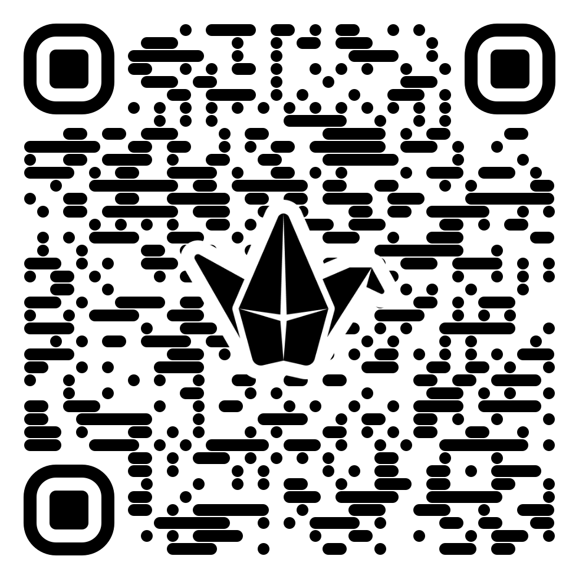
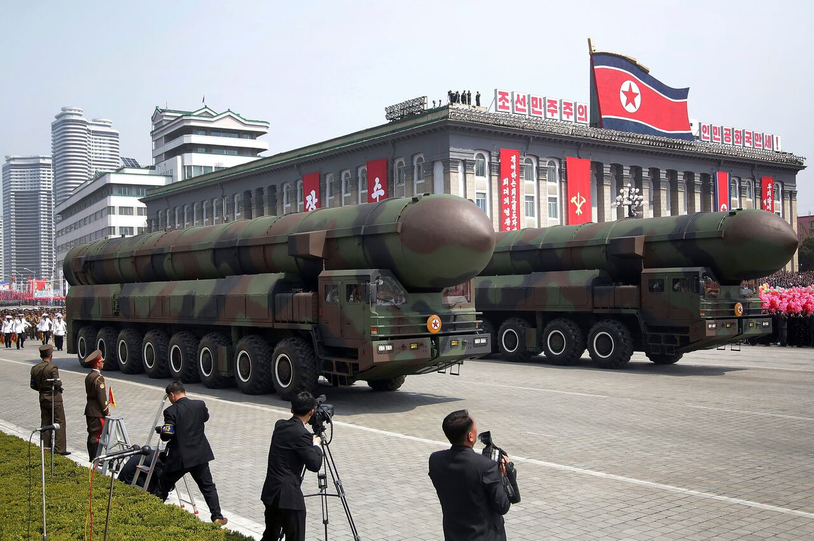

## Acknowledgement of Country

I would like to acknowledge the Traditional Owners of Australia and recognise their continuing connection to land, water and culture. The University of Sydney is located on the land of the Gadigal people of the Eora Nation. I pay my respects to their Elders, past and present.

## This Week's Readings

::: {layout-ncol="2"}
### Required

- Bardin, J.S. (2025). Cyber Warfare. In *Computer and Information Security Handbook*, Elsevier. Ch. 87.
- Whyte, C. & Mazanec, B. (2023). *Understanding Cyber-Warfare*. Ch. 5: Attack — From Exploitation to Offensive Cyber Operations.
- Whyte, C. & Mazanec, B. (2023). *Understanding Cyber-Warfare*. Ch. 7: The Topology and History of Major Cyber Conflict Episodes.
- Buchanan, B. (2020). *The Hacker and the State*. Ch. 6: Strategic Sabotage.

### Recommended

- Rid, T. (2012). Cyber War Will Not Take Place. *Journal of Strategic Studies*, 35(1), 5–32.
:::

## Learning Objectives

By the end of this lecture, you will be able to:

- Distinguish between computer network exploitation (CNE) and computer network attack (CNA)
- Explain the special characteristics of cyber weapons and why they challenge traditional strategic concepts
- Analyse key case studies of state-sponsored cyber operations (Stuxnet, Estonia, Ukraine)
- Evaluate the patterns and trends in interstate cyber conflict using empirical data
- Critically assess the debate over whether "cyber war" is a meaningful concept

::: notes
This week moves from governance and policy to the operational dimension of cybersecurity — what states actually do to each other in cyberspace. We cover the full spectrum from espionage to sabotage, grounding the discussion in both theory and key historical cases.
:::

# Part 1: Defining Offensive Cyber Operations

## What Are Offensive Cyber Operations?

Offensive Cyber Operations (OCOs) are the employment of cyber capabilities where the primary purpose is to achieve objectives **in or through cyberspace** (Whyte & Mazanec, 2023).

. . .

OCOs are comprised of two broad categories:

- **Computer Network Exploitation (CNE)**: Gaining unauthorised access to collect information — cyber *espionage*
- **Computer Network Attack (CNA)**: Using cyber means to disrupt, degrade, or destroy — cyber *sabotage*

::: notes
The distinction between CNE and CNA is foundational, but as we'll see, the line between them is very thin. The same access used for espionage can quickly become the basis for an attack.
:::

## The Thin Line: CNE → CNA

::: callout-important
### Key Insight from Whyte & Mazanec
The difference between cyber crime, cyber-espionage, and cyber war is just a couple of keystrokes. The same technique that enables stealing information can enable destroying things.
:::

. . .

This has profound implications:

- Defenders **cannot tell** if an intrusion is reconnaissance or a prelude to attack
- The same access used today for espionage could be weaponised tomorrow
- This creates a **security dilemma** in cyberspace

::: notes
This is one of the most important concepts for the course. The inability to distinguish between espionage and pre-attack preparation creates fundamental instability in interstate cyber relations. It's worth pausing to let students absorb this point.
:::

## The "Offence-Persistent" Environment

Cyberspace is characterised as an **offence-persistent strategic environment** (Harknett & Goldman, 2016):

- There is a constant and continual range of offensive operations
- Defenders can react to attacks as they occur, but building lasting security against future attacks is extremely difficult
- Attackers have structural advantages over defenders

. . .

This environment has shaped US strategy toward **"persistent engagement"** and **"defend forward"** — proactively contesting adversaries in cyberspace rather than simply waiting to be attacked.

## Four Objectives of State Hacking

Drawing on the DCID dataset (Whyte & Mazanec, Ch. 7), state cyber operations serve four principal objectives:

. . .

1. **Information exfiltration** — stealing sensitive data (the most common objective)
2. **Disruption, degradation, or destruction** — damaging systems or infrastructure
3. **Enabling attacks** — supporting conventional military operations
4. **Information environment manipulation** — shaping political discourse

::: notes
Each of these has different risk profiles, different resource requirements, and different strategic implications. Students should understand that most state hacking is espionage, not sabotage.
:::

## 🗣️Can you think of a real-world cyber event belonging to one of these four objectives?

Before we go further, let me ask you:

1. **Information exfiltration** — stealing sensitive data
2. **Disruption, degradation, or destruction** — damaging systems or infrastructure
3. **Enabling attacks** — supporting conventional military operations
4. **Information environment manipulation** — shaping political discourse

{fig-align="center" width=30%}

---

<iframe src="https://padlet.com/embed/r4zqys31lgaojs70" frameborder="0" allow="camera;microphone;geolocation;display-capture;clipboard-write" style="width:100%;height:608px;display:block;padding:0;margin:0"></iframe>

<a href="https://padlet.com?ref=embed" style="display:flex;align-items:center;gap:5px;flex-grow:0;margin:0;border:none;padding:0;text-decoration:none" target="_blank">Made with</a>

# Part 2: The Toolkit of Cyber Warfare

## Cyber Weapons: A Taxonomy

Bardin (2025) identifies several key categories of cyber weapons:

- **Advanced Persistent Threats (APTs)**: Prolonged, targeted intrusions for data theft or surveillance
- **Ransomware**: Encrypting data for extortion — or strategic disruption
- **Zero-day exploits**: Attacking unknown software vulnerabilities
- **DDoS attacks**: Overwhelming systems with traffic
- **Supply chain attacks**: Compromising trusted suppliers to reach the real target
- **Social engineering / Spear phishing**: Exploiting human psychology

::: notes
Emphasise that these are not mutually exclusive — sophisticated operations combine multiple techniques. Stuxnet used zero-days, social engineering, and supply chain vectors simultaneously.
:::

## Supply Chain Attacks: An Indirect Path

::: callout-note
### What makes supply chain attacks distinctive?
Supply chain attacks **compromise less secure partners or suppliers** to gain access to the target organisation's systems **indirectly** (Bardin, 2025).
:::

. . .

Key characteristics:

- Bypass the target's direct defences entirely
- Exploit trust relationships between organisations
- Software from a trusted supplier may evade security checks
- Can be stealthy and persistent over extended periods

. . .

Traditional concepts of territorial integrity lose relevance when an attacker can undermine infrastructure without setting foot on a nation's soil.

## Ransomware as a Strategic Weapon

In cyber warfare, ransomware transcends simple financial extortion (Bardin, 2025):

. . .

- **Strategic disruption**: Disabling critical infrastructure (power, healthcare, transport)
- **Psychological impact**: Sowing public panic and undermining confidence in government
- **Plausible deniability**: Attacks mimic criminal activity, making state attribution harder
- **Diversion**: The ransom demand can distract from the real objective (e.g., data exfiltration)

. . .

::: callout-warning
### NotPetya (2017)
Disguised as ransomware but was actually a destructive wiper (malaware designed to *wipe* hard drives). Originated in Ukraine, spread globally. Estimated damages exceeded **$10 billion**.
:::

---



## APTs: The Long Game

**Advanced Persistent Threats** are particularly suited to cyber espionage because:

- They involve **prolonged, covert access** — remaining undetected for months or years
- Enable **sustained data exfiltration** or ongoing surveillance
- Require high expertise and resources, often associated with **state sponsorship**
- Their long-term presence distinguishes them from other attack types

. . .

Think of APTs as a digital equivalent of having a spy embedded inside a foreign intelligence service — but far more scalable.

## Data Poisoning: A Newer Threat

Data poisoning targets the reliability of **machine learning algorithms** by deliberately contaminating training data (Bardin, 2025):

. . .

- Could cause automated **defence systems to misidentify** threats
- Compromise **intelligence analysis** tools, leading to flawed decisions
- Particularly dangerous as militaries increasingly rely on AI-driven systems

. . .

::: callout-important
As military and intelligence applications of AI grow, data poisoning becomes a critical vector for undermining adversary capabilities without directly attacking systems.
:::

## The Special Characteristics of Cyber "Weapons"

Whyte & Mazanec (Ch. 5) identify several characteristics that make cyber weapons unique:

. . .

1. **Attribution challenge** — Extremely difficult to trace back to the attacker
2. **Multiuse nature** — Same technologies have offensive, defensive, and civilian applications
3. **Unpredictability & collateral damage** — Effects are hard to predict; networks are interconnected
4. **Questionable deterrent value** — Secrecy requirements undermine credible threats
5. **Importance of secrecy and surprise** — Revealing capabilities can negate them
6. **Asymmetric appeal** — Low cost, global reach — attractive to weaker actors
7. **Force multiplier potential** — Can complement conventional military operations

::: notes
Spend time on the deterrence point — it connects to broader IR theory. Unlike nuclear weapons, you can't showcase cyber weapons to deter adversaries because doing so reveals the exploit and allows the defender to patch it.
:::

## Why Cyber Weapons Have Questionable Deterrent Value

::: callout-important
### The Secrecy-Deterrence Paradox
Cyber weapons require **secrecy and surprise** to be effective. But deterrence requires **credible threats**. Making a credible threat about a specific cyber capability invites the target to take protective action, which **blunts the deterrent value**.
:::

. . .

This is fundamentally different from nuclear deterrence, where weapons are *demonstrated* to enhance credibility.

. . .

Implication: Cyber weapons are more likely to be used **preemptively** or as **force multipliers** than as strategic deterrents.

---

A **strategic deterrent** is a capability that discourages an adversary from taking a particular action because the threatened cost of retaliation is so severe and so credible that the adversary decides it's not worth it. The logic is: "I know you can and will hurt me badly if I act, so I won't act."
The textbook example is **nuclear weapons** during the **Cold War** and their Mutually Assured Destruction (MAD).  

::: {style="text-align: center;"}

:::

## So far...

We've discussed **what** states want to achieve in cyberspace and **why** cyber weapons behave differently from conventional ones.

. . .

But **what does an offensive cyber operation actually look like** in practice?

How does an attacker go from identifying a target to completing their mission — whether that's stealing data, destroying centrifuges, or blinding a radar system?

. . .

To answer this, we turn to the **Cyber Kill Chain** — a model that breaks down the operational phases an attacker moves through.

## The Cyber Kill Chain

The Kill Chain is a model for understanding the operational phases of a cyber attack (Whyte & Mazanec, Ch. 5):

. . .

1. **Initial Reconnaissance** — Researching the target
2. **Initial Compromise** — Gaining first access (e.g., via phishing)
3. **Establish Foothold** — Ensuring continued access
4. **Escalate Privileges → Internal Recon → Move Laterally → Maintain Presence**
5. **Complete the Mission** — Data theft, disruption, or destruction

. . .

::: callout-note
The Kill Chain is a useful conceptual tool, but real-world operations — especially sophisticated APTs — involve multiple overlapping Kill Chains and non-cyber actions.
:::

## 🧠 Quiz: Identify the Attack Type

A software company that supplies IT management tools to thousands of organisations — including government agencies — is compromised. The attackers insert malicious code into a routine software update. When customers install the update, the attackers gain access to their networks. The operation goes undetected for months, during which the attackers quietly exfiltrate data from selected high-value targets.

. . .

Which type(s) from our taxonomy best describe this operation?

a. DDoS attack
b. Supply chain attack
c. Zero-day exploit
d. Ransomware
e. Advanced Persistent Threat (APT)

{fig-align="center" width=12%}

---

<iframe sandbox='allow-popups allow-scripts allow-same-origin allow-presentation' allowfullscreen='true' allowtransparency='true' frameborder='0' height='315' src='https://www.mentimeter.com/app/presentation/ales843mrfudri9knpxtd8njbmpcdsou/embed' style='position: absolute; top: 0; left: 0; width: 100%; height: 100%;' width='420'></iframe>

---

**Answer: B and E.** This describes the SolarWinds attack (2020). It was a **supply chain attack** — the attackers compromised a trusted supplier to reach the real targets. And it was an **APT** — the attackers maintained prolonged, covert access for sustained espionage. Note how multiple categories overlap in a single operation.

# Part 3: Case Studies — From Espionage to Sabotage

## Case Study 1: Stuxnet / Operation Olympic Games

:::: {layout-ncol="2"}
::: {.column}
### The Context
- Iran pursuing nuclear weapons capability
- US bogged down in Iraq/Afghanistan
- Israel pressing for action
- Conventional military options too risky
- Bush administration needed **time**
:::

::: {.column}
### The Solution
- Joint US-Israeli covert cyber operation
- Code name: **Olympic Games**
- Target: Centrifuges at **Natanz** enrichment facility
- Weapon: **Stuxnet** worm
- Objective: Sabotage equipment, cause delay, undermine confidence
:::
::::

::: notes
Buchanan's account is essential here. Emphasise this as the paradigm case of cyber sabotage — it showed what was possible but also revealed significant limitations.
:::

---

::: {style="text-align: center;"}
 
:::

## Stuxnet: How It Worked

The operation required extraordinary preparation (Buchanan, 2020):

. . .

- **Reconnaissance**: A mole recruited by Dutch intelligence inside Natanz; the Fanny worm gathered configuration data
- **Air gap challenge**: Natanz computers were not connected to the internet — Stuxnet spread via USB drives
- **Testing**: The US used **Libyan centrifuges** (same supplier network as Iran's) to test attack code; Israel built a **replica facility** in the desert
- **Payload**: Manipulated centrifuge rotor speeds (accelerating to 84,600 RPM then slowing to 120 RPM), causing erratic failures
- **Deception**: Stuxnet played back recordings of normal operation on monitoring systems while centrifuges destroyed themselves

## Stuxnet: What It Achieved

- Destroyed more than **1,000 centrifuges**
- Delayed Iran's enrichment programme by an estimated **1–3 years**
- Iranian engineers were fired for incompetence — they couldn't find the cause
- Created time for sanctions and diplomacy

. . .

But Stuxnet also:

- **Spread beyond Natanz** — infected 100,000+ computers in 100+ countries
- Was **discovered** by a small Belarusian antivirus firm (VirusBlokAda)
- Became the **most studied cyber weapon** in history, revealing its techniques to the world

## Stuxnet: The "Power to Thwart"

::: callout-important
### Buchanan's Key Argument
Stuxnet was not an exercise in Schelling's "power to hurt" — coercing an adversary through visible pain. It was designed to **shape the situation** by creating erratic, inexplicable failures that caused Iran to **doubt its own technical competence** and **buy time** for diplomacy.
:::

. . .

This required **secrecy**. If Iran knew the cause was foreign sabotage, they could simply press ahead. The strategic value lay in concealment.

. . .

Contrast with traditional deterrence: Stuxnet worked *because* it was secret, not despite it.

{width=20% fig-align="center"}

A parade in North Korea. (Wong Maye-E/Associated Press) An example of traditional **deterrence.**

## The Wiper Operation (2012)

A less well-known but significant companion to Stuxnet (Buchanan, 2020):

. . .

- Targeted Iran's **Oil Ministry** and oil infrastructure
- Wiped computers across multiple organisations, including the National Iranian Oil Company
- Six major oil terminals went offline — one handling **80% of Iran's crude exports**
- The code **destroyed itself** after executing, leaving almost no forensic evidence

. . .

Wiper appears to have complemented the sanctions regime — a direct strike at the economic lifeblood of the Iranian state.

## Case Study 2: Estonia (2007)

The first major example of **cyber blockade** (Whyte & Mazanec, Ch. 7):

. . .

{width=20% fig-align="center"}

- **Trigger**: Dispute over relocation of the Bronze Soldier of Tallinn (Soviet-era memorial)
- **Phase 1**: Website defacement, DDoS attacks against government sites
- **Phase 2**: Over **1 million zombie computers** worldwide flooding Estonian servers with 1,000x normal traffic
- **Effect**: Estonia largely **cut off from the outside world** for days
- **Attribution**: Evidence pointed to Russia, but centralised control was unclear

. . .

**Aftermath**: NATO established the **Cooperative Cyber Defence Centre of Excellence (CCD COE)** in Tallinn — a watershed moment for international cybersecurity cooperation.

## Case Study 3: Russia-Ukraine Cyber Operations

A pattern of escalating cyber operations alongside geopolitical tensions:

. . .

- **2014**: DDoS attacks during Crimea annexation; election interference attempts
- **2015–2016**: **Black Energy** attacks on Ukrainian power grid — first successful **cyber-physical attack on critical infrastructure**, leaving ~1.4 million without power
- **2017**: **NotPetya** — disguised as ransomware but designed for destruction; originated in Ukraine, spread globally
- **2022 onwards**: Continued cyber operations alongside the full-scale invasion

. . .

::: callout-note
The Russia-Ukraine case demonstrates the integration of cyber operations into broader military and geopolitical strategy — what some call **"hybrid warfare."**
:::

## Case Study 4: Operation Orchard (2007)

An example of cyber operations as an **enabling attack** (Whyte & Mazanec, Ch. 7):

. . .

- Israeli F-15 and F-16 aircraft attacked a suspected **nuclear reactor in Syria**
- Israel used a cyber capability to **disrupt Syrian air defence radar** systems
- False sensor information masked the transit of jets into Syrian airspace
- The kinetic mission succeeded because the cyber operation neutralised defences

. . .

::: callout-note
This is perhaps the **best documented example** of cyber capabilities used as a **force multiplier** for conventional military operations.
:::

## 🗣️ Active Learning: Comparing Cases

Let's compare these cases across key dimensions:

| | Stuxnet | Estonia | Ukraine Power Grid | Operation Orchard |
|---|---|---|---|---|
| **Type** | ? | ? | ? | ? |
| **Objective** | ? | ? | ? | ? |
| **Physical damage?** | ? | ? | ? | ? |
| **Attribution** | ? | ? | ? | ? |

. . .

{fig-align="center" width=30%}

::: notes
Give 5 minutes. Students should classify each as CNE/CNA, identify objectives (sabotage, disruption, enabling), note whether physical effects occurred, and discuss attribution certainty. Debrief by highlighting that even the most severe operations — Stuxnet — did not cause casualties, and most cyber conflict remains below the threshold of "armed attack."
:::

---

<iframe src="https://padlet.com/embed/70dbwtxzvt53jf6g" frameborder="0" allow="camera;microphone;geolocation;display-capture;clipboard-write" style="width:100%;height:608px;display:block;padding:0;margin:0"></iframe>

<a href="https://padlet.com?ref=embed" style="display:flex;align-items:center;gap:5px;flex-grow:0;margin:0;border:none;padding:0;text-decoration:none" target="_blank">Made with</a>

---

## Stuxnet Revisited: A Multi-Layered Case

Stuxnet rewards analysis across multiple dimensions:

. . .

- **Technical**: Air-gapped target, USB propagation, zero-day exploits, tailored payload
- **Strategic**: Buying time for diplomacy, shaping the situation, secret sabotage
- **Reconnaissance**: Unlike conventional weapons, cyber weapons must be **tailored to the specific configurations** of the target — requiring deep intelligence
- **Limitations**: Spread beyond its target, was discovered, techniques were revealed
- **Consequences**: Iran invested in its own offensive cyber capabilities in response (Shamoon, Operation Ababil)

## The Escalation Question

::: callout-warning
### A pattern to note
Stuxnet → Iran develops offensive capabilities → Shamoon attack on Saudi Aramco (2012) → Operation Ababil DDoS attacks on US banks (2012–13)

Cyber operations can trigger **retaliation** and **proliferation** of offensive capabilities.
:::

. . .

Yet the empirical record also shows **remarkable restraint**: cyber operations very rarely produce concessions, and responses tend to be proportional rather than escalatory (Valeriano et al., 2018).

# Part 4: Patterns in Interstate Cyber Conflict

## Who Hacks? Evidence from the DCID Dataset

The Dyadic Cyber Incidents and Dispute (DCID) dataset identifies **429 significant cyber conflict episodes** involving ~24 countries over two decades (2000–2021) (Whyte & Mazanec, Ch. 7).

. . .

Four countries are responsible for the **vast majority** of major incidents:

- **China** — Primarily long-term espionage and IP theft
- **Russia** — Espionage + disruption + information operations
- **Iran** — Retaliatory operations + regional rivalry with Israel/Saudi Arabia
- **North Korea** — Asymmetric operations + revenue generation (ransomware)

## What Are States Trying to Achieve?

Key findings from the DCID data:

. . .

- **China and Russia**: Use cyberspace almost exclusively for **espionage** — both short-term and long-term
- **United States and Israel**: More willing to authorise **degradative operations** against military targets — higher average severity scores
- **Others** (Japan, India, Pakistan, Turkey): Largely aim to **disrupt** competitors

. . .

::: callout-important
### A crucial finding
Countries like the US, Israel, and Vietnam have **higher average severity** for their operations, even though China, Russia, Iran, and North Korea are responsible for far **more incidents**. Democracies appear to hack less frequently but more consequentially.
:::

## The Regionalism of Cyber Conflict

Cyber conflict is **highly regional and rivalrous** (Whyte & Mazanec, Ch. 7):

. . .

- **Russia** → United States, Ukraine, Georgia, European NATO members
- **China** → United States, Japan, Australia, Vietnam
- **Iran** ↔ **Israel** (a deeply entrenched rivalry)
- **India** ↔ **Pakistan** (mutual operations)
- **North Korea** → South Korea, United States

. . .

Cyber conflict largely mirrors existing **geopolitical rivalries**. It does not create entirely new patterns of conflict but extends existing ones into a new domain.

## Trends Over Time: Diversification

Two key trends (Whyte & Mazanec, Ch. 7):

. . .

1. **Shorter episodes**: Average length of cyber campaigns has decreased since ~2012 — possibly reflecting improved defences
2. **More frequent episodes**: The number of incidents has increased substantially, particularly after 2007 and again after 2014

. . .

Additionally:

- **State-sponsored proxies** have become increasingly common — providing plausible deniability
- **Information operations** have become intertwined with cyber conflict, especially from 2014 onward
- **Ransomware** attacks are rising but remain primarily **criminal**, not strategic

## Severity: A Sobering Finding

::: callout-important
### What the data tells us
No cyber operation has ever led to **direct or indirect deaths**, caused destructive effects to **national critical infrastructure** on a permanent basis, or **substantially disrupted a national economy** entirely on its own (DCID data).
:::

. . .

Most episodes involve:

- Vandalism or basic disruption
- Theft of data from one critical national security network
- Theft of data from a multi-network compromise

. . .

Only **six episodes** have achieved the most severe level: infiltration of a critical national security network to cause physical destructive effects against targeted systems (e.g., Stuxnet, Shamoon).

## The Debate: "Cyber War Will Not Take Place"

Thomas Rid (2012) argues that **cyber war has never happened** and likely never will:

. . .

- All cyber operations to date are sophisticated forms of **sabotage**, **espionage**, or **subversion**
- They do not meet Clausewitz's definition of war: violent, instrumental, and political
- Cyber operations lack the **lethality** and **physical destruction** of traditional warfare

. . .

**Counter-arguments**:

- Stuxnet caused physical destruction — does that not count?
- Cyber operations integrated with kinetic operations (Ukraine) blur the line
- The effects of espionage and subversion can be profoundly destabilising even without violence

## 🗣️ Active Learning: Does "Cyber War" Exist?

Based on what we've covered:

. . .

- Do you agree with Rid that "cyber war will not take place"?
- Is the term "cyber war" useful or misleading?
- Should we think of cyber operations as a **new form of conflict** or an extension of traditional espionage and sabotage?

::: notes
Open floor discussion — 5 minutes. This maps directly to the Rid recommended reading. Push students to consider both sides. Some may argue that the term is useful for raising awareness and allocating resources even if technically inaccurate. Others may argue it inflates threat perceptions and leads to militarised responses to what is essentially espionage.
:::

## 🗣️ Active Learning: Applying What We've Discussed

Think about a country — your home country or Australia:

. . .

- What kinds of cyber threats does it face?
- Given what you know about the characteristics of cyber weapons (attribution challenges, asymmetry, deterrence problems), how should it respond?
- Is a "defend forward" approach appropriate for all countries, or mainly for great powers?

::: notes
This is a good capstone discussion — 5 minutes in pairs, then brief sharing. It connects the theoretical material to students' own contexts. Encourage students to think about whether smaller nations have different strategic options than the US.
:::

## Summary: Key Takeaways

1. **Cyber operations exist on a spectrum** from espionage to sabotage, with the same access enabling both
2. **Cyber weapons have unique characteristics** that challenge traditional strategic concepts — especially deterrence
3. **Stuxnet represents a watershed** — the first major cyber-physical sabotage operation — but also revealed the limits of such operations
4. **Empirical data shows** that most cyber conflict is espionage, not warfare; it mirrors geopolitical rivalries; and it rarely produces the dramatic effects often predicted
5. **The "cyber war" debate** forces us to think carefully about how we categorise and respond to digital threats

## See you next week with Digital Dissent: Hacktivism, Social Movements, and Digital Repression

