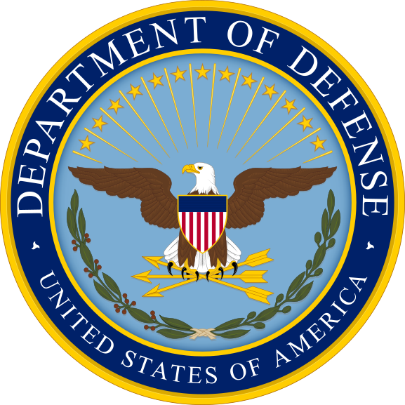

## Acknowledgement of Country

We acknowledge the Traditional Owners of the lands on which we meet today. We pay our respects to the Elders past and present, and extend that respect to all Aboriginal and Torres Strait Islander peoples.

## Today's plan

* **Part 1:** The Cyber-Threat Landscape
* **Part 2:** Jurisdiction and Prosecution of Cybercrime
* **Part 3:** International Norms and Law for Offensive Cyber Operations

# Part 1: The Cyber-Threat Landscape {background-color="#0148A4"}

## Understanding Cyber-Threats

The cyber-threat landscape is diverse and evolving, encompassing various actors with different motivations, capabilities, and targets.

::: notes
Understanding the full spectrum of cyber-threats is essential for appropriate policy responses and resource allocation.
:::

## Categories of Cyber-Threats

Six main categories [@dunncaveltyPoliticsCyberSecurity2024, Ch. 5]:

1. **Cyber-crime** - Financial gain, organized groups
2. **Hacktivism** - Political/social causes
3. **Cyber-espionage** - State-sponsored intelligence gathering
4. **Cyber-influence operations** - Information manipulation
5. **Cyber-terrorism** - Ideologically motivated attacks
6. **Cyber-war** - State-on-state conflict

::: notes
Each category has distinct perpetrators, intents, targets, and frequency. These distinctions matter for understanding appropriate responses.
:::

## Cyber-Crime: The Most Common Threat

**Key developments:**

* **Professionalization** - Crime-as-a-Service models
* **Ransomware** - Major threat to organizations worldwide
* **Organized groups** - Sophisticated criminal enterprises
* **State nexus** - Criminal methods used by state actors

::: notes
Cyber-crime has evolved from individual hackers to sophisticated organized groups with business models and specialized roles.
:::

## The Rise of Ransomware

**CryptoLocker (2013) - The Turning Point [@dunncaveltyPoliticsCyberSecurity2024]:**

* Used strong encryption algorithms (RSA-2048)
* Demanded cryptocurrency payment (Bitcoin)
* Caused widespread disruption across multiple sectors
* Established ransomware as a major cybersecurity threat

::: callout-note
### WannaCry Ransomware (2017)
Built on CryptoLocker's model: affected over 200,000 computers in 150 countries, exploiting a leaked NSA vulnerability. [Video](https://youtu.be/etPizFNPupk?si=Q8qzV2ky5onccq5l)
:::

## Ransomware and Critical Infrastructure

**Why critical infrastructure is particularly attractive [@dunncaveltyPoliticsCyberSecurity2024]:**

* **Urgent operational needs** - Essential services cannot afford downtime
* **High payment likelihood** - Organizations more likely to pay to restore services quickly
* **Hospitals, utilities, transport** - Cannot wait for lengthy recovery processes
* **Public pressure** - Need to resume services creates time pressure

::: callout-important
From a purely financial perspective, the urgent need to keep essential services running makes it more likely that victim organizations will pay the ransom demanded
:::

## Organizational Models in Cybercrime Ecosystems

**Dunn Cavelty identifies two main organizational models [@dunncaveltyPoliticsCyberSecurity2024]:**

**1. Hierarchical Business Ecosystems**

* Resemble large IT companies
* Structured roles and divisions of labor
* Crime-as-a-Service platforms
* Professional management structures

**2. Fluid Swarming Model**

* Loose networks of independent actors
* Temporary collaborations
* Decentralized operations
* Flexible and adaptive structures

::: notes
These different organizational models reflect the diversity and sophistication of modern cybercrime. Some groups operate like corporations while others maintain flexibility through loose networks.
:::

## State Actors Using Criminal Methods

**Case Study: North Korea's Lazarus Group**

Uses cyber-crime to generate revenue for the regime:

* Sony Pictures hack (2014)
* Bangladesh Bank heist (2016) - $81 million stolen
* WannaCry ransomware (2017)

::: callout-important
Blurs the line between state espionage and criminal activity, complicating attribution and response
:::

::: notes
North Korea demonstrates how states can employ criminal methods for strategic purposes, making traditional categories less clear.
:::

## The 2026 Canvas Security Incident: Anatomy of the attack

- **Target**: Canvas LMS — ~8,800 institutions, 50 countries, dominant in higher ed
- **Actor**: *ShinyHunters* — financially motivated, part of "The Com" ecosystem; the same brand behind the Snowflake (2024) and Salesforce (2025) campaigns
- **Initial vector**: application-layer flaw in the *Free-For-Teacher* support-ticket system — not a zero-day
- **Timeline**: detected 29 Apr → "resolved" 6 May → **re-intrusion 7 May** with the same vector, login pages defaced
- **Outcome**: ~275M records, 3.65 TB exfiltrated — names, emails, student IDs, and private messages

**Defensive lesson**: identity-layer attack, not endpoint malware. Phishing-resistant MFA (FIDO2), SaaS telemetry, and OAuth monitoring matter more than AV.

::: aside
Sources: Wikipedia; Google Threat Intelligence (Mandiant); FBI IC3; MITRE ATT&CK C0059.
:::

## Geopolitics and governance

- **Attribution**: ShinyHunters is a *brand*, not a fixed group — decentralised, mostly young Western operators. Not state-sponsored.
- **Ransom paid** (11 May): Instructure settled for an undisclosed sum, received "shred logs" as proof of destruction
- **Precedent**: a private US vendor negotiates on behalf of 8,800+ public-sector customers worldwide
- **Notification collision**: GDPR (General Data Protection Regulation, EU), FERPA (Family Educational Rights and Privacy Act, US), Australian NDB scheme and state laws all triggered by one incident

::: aside
Sources: *Inside Higher Ed*; Trend Micro; US Dept of Education FSA advisory (12 May 2026).
:::

## Frequency and Impact

Different threat types vary in frequency:

* **High frequency:** Cyber-crime, hacktivism
* **Medium frequency:** Cyber-espionage, influence operations
* **Low frequency:** Cyber-terrorism, cyber-war

::: fragment
**Important:** Low frequency does not mean low impact - state-level cyber operations can have catastrophic consequences
:::

::: notes
While cyber-crime is most common, we must not neglect less frequent but potentially more severe threats from state actors.
:::

## When Cybercrime Becomes a Security Political Issue

**Dunn Cavelty distinguishes between ordinary law enforcement and security politics [@dunncaveltyPoliticsCyberSecurity2024]:**

**Cybercrime becomes a security political issue when:**

1. **Political motivation** - Connection to a politically motivated actor (e.g., state-sponsored groups)

2. **Significant damage** - Single incidents causing major disruption (e.g., WannaCry, Colonial Pipeline)

3. **Cumulative effects** - Multiple incidents accumulating to cause significant societal impact

::: fragment
**Implication:** Not all cybercrime is treated equally - some rises to the level of national security concern while most remains ordinary law enforcement
:::

::: notes
This distinction is important for understanding policy responses and resource allocation. Security political issues receive higher-level attention and different policy instruments.
:::

# Part 2: Jurisdiction and Prosecution of Cybercrime

## Foundations of Public International Law [@crawford_Introduction_2019]

### Defining the International Legal Order

**What is International Law?**

* It is a specialised body of *legal thinking* regarding the relations between rulers and states.
* **The Westphalian Model (1648):** Established the modern concept of the nation-state and the principle of **Sovereignty**.
* **Traditional Focus:** Historically cantered on territorial claims, treaties, and the "Just War" doctrine.
* **Modern Expansion:** Now encompasses international organisations (like the UN) and individual responsibilities (international criminal law).

## The Four Sources of International Obligation

According to **Article 38(1)** of the Statute of the International Court of Justice (ICJ), there are four primary sources used to determine legal rules:

1. **International Conventions (Treaties):** Explicit written agreements where states formally consent to be bound.
2. **International Custom (Customary Law):** Evidence of a general practice accepted as law. It requires consistent state behavior and *opinio juris* (the belief that the action is a legal obligation).
3. **General Principles of Law:** Core tenets recognised by nations (e.g., "Good Faith" or "Res Judicata") applied to the international level.
4. **Subsidiary Means:** Judicial decisions and the "teachings of the most highly qualified publicists" (scholarly works) used as evidence of law.

## Sovereignty and Legal Personality

**Core Concepts for Governance**

* **Sovereign Equality:** The principle that all states have the same legal standing, regardless of their size or power.
* **International Legal Personality:** The capacity to possess rights and duties under international law. While states are the primary subjects, International Organizations (like the ITU) also possess this personality to function.
* **The "Reality" of Law:** International law is decentralised. Most states follow these rules most of the time because systematic cooperation is necessary for global trade, security, and communications.

## The Jurisdictional Challenge

**Core problem:** Cybercrime is inherently transnational

{fig-align="center" width=15%}

* Perpetrators in one country
* Infrastructure in another country
* Victims in yet another country

::: fragment
**Critical question:** Which state has the right to prosecute?
:::

::: notes
The borderless nature of cyberspace creates complex jurisdictional questions that traditional legal frameworks struggle to address.
:::

## Types of Jurisdiction

**Three main approaches [@arnellProsecutionCybercrimeWhy2023]:**

1. **Territorial jurisdiction**
   - Objective (harmful effects occur in the state)
   - Subjective (conduct initiated in the state)

2. **Transnational jurisdiction** - Crime has transnational elements

3. **Extraterritorial jurisdiction** - State prosecutes acts outside its territory

::: notes
Each approach has different implications for sovereignty, international law, and practical enforcement.
:::

## The Current Trend: Expansive Jurisdiction

**Many states now claim broad jurisdiction over cybercrimes:**

* U.S. prosecutes foreign hackers who target American systems
* European states assert jurisdiction over data breaches
* Multiple states claim authority over the same conduct

::: fragment
**Result:** Overlapping claims, conflicts, and jurisdictional complexity
:::

::: notes
This trend reflects states' desires to protect their interests but creates significant legal and political problems.
:::

## Problems with Transnational Jurisdiction

**Arnell & Faturoti argue against expansive jurisdiction [@arnellProsecutionCybercrimeWhy2023]:**

* **Conflicts with international law** - Sovereignty violations
* **Human rights concerns** - Forum shopping, extradition abuses
* **Practical difficulties** - Complexity, costs, evidence gathering
* **Political tensions** - Inter-state conflicts and diplomatic strain

::: notes
The authors present a compelling case that current trends toward expansive jurisdiction create more problems than they solve.
:::

## The Expansion of Human Rights in International Law [@crawford_International_2019]

**From State-Centrism to Individual Rights**

* 
**Historical Context**: Traditionally, international law was based on the "common consent of individual States, and not of individual human beings".

* 
**Twentieth Century Shift**: Over the 20th century, the system underwent a "profound process of expansion," which included the emergence of human rights as a major sub-discipline.

* 
**The Modern Reality**: It is now "no longer possible to deny that individuals may have rights and duties in international law".

* 
**Qualified Personality**: Unlike states, which have inherent personality, an individual's rights depend on the "operation of particular rules of international law".

## Human Rights as "General Interest" Obligations

**Beyond Bilateralism**

* 
**The General Interest**: International law is increasingly used to create obligations in the "general interest," specifically for the protection of human rights.

* 
**Implementation Challenges**: Because there is "no legal manifestation of the 'international community,'" the burden of securing these rights often falls on other states.

* 
**State Responsibility**: States parties may take action to implement these commitments even if they are not the "direct victims of any breach of the law".

* 
**Emergent Public Law**: This development is seen as the beginning of a "limited system of rules of public law" within the international legal framework.

## Individual Accountability and Legal Personality

**The Framework of Responsibility**

* 
**International Criminal Law**: A growing body of rules now subjects the conduct of individuals, including state officials, to international criminal law.

* 
**New Categories of Personality**: Human rights developments have added individuals—and sometimes corporations—as qualified categories of "personality" within the system.

* 
**The Role of Tribunals**: These rights and duties are increasingly administered and adjudicated by international tribunals.

* 
**Systemic Purpose**: Despite inequalities between states, human rights provide part of the "normative structure" for a rules-based international society.

## Case Study: Gary McKinnon

**Background:**

* UK citizen with Asperger's syndrome
* Hacked U.S. military systems from his London home (2001-2002)
* Claimed he was searching for evidence of UFOs

**U.S. extradition request:**

* Faced up to 70 years in U.S. prison
* Prolonged legal battle in UK
* Eventually blocked on human rights grounds (2012) [Video](https://youtu.be/LEvGU1b4ysw?si=GTcV9g8VIGEUL-1h)

::: notes
McKinnon's case highlighted concerns about disproportionate punishment and the vulnerability of individuals with mental health conditions in extradition proceedings.
:::

## Case Study: Lauri Love

**Background:**

* UK citizen, computer scientist
* Accused of hacking U.S. agencies (Army, NASA, FBI)
* Alleged member of Anonymous collective

**Outcome:**

* U.S. sought extradition
* UK High Court denied extradition (2018)
* Cited human rights concerns and risk of suicide
* Could be tried in UK instead

::: notes
Love's case further established limits on U.S.-UK extradition in cybercrime cases, particularly regarding mental health protections.
:::

## Case Study: Julian Assange

- Who's Assange? [Video](https://youtube.com/shorts/eu1jv7io-ME?si=1FntTD27pZudVqAH)

**Background:**

* Australian founder of WikiLeaks
* Published classified U.S. documents
* Complex jurisdictional issues spanning multiple countries

**Jurisdictional complexity:**

* Swedish investigation (sexual assault allegations)
* U.S. prosecution (espionage-related charges)
* UK extradition proceedings
* Ecuador embassy asylum (2012-2019)
* On April 2019, Ecuador revoked asylum, arrested by British Police

::: notes
Assange's case demonstrates the extreme complexity that can arise when multiple jurisdictions and political considerations intersect.
:::

## Case Study: Julian Assange /2

- Plea Agreement and Sentencing: On 24 June 2024, Julian Assange agreed to a plea bargain to plead guilty to one felony count of violating the Espionage Act in exchange for a 62-month sentence, which was credited as time already served.  

- Release and Return to Australia: After his formal sentencing in Saipan on 26 June, Assange flew to Canberra where he was reunited with his family and personally thanked Prime Minister Albanese for his role in securing his release.  

## The Proposed Way Forward

**Arnell & Faturoti recommend [@arnellProsecutionCybercrimeWhy2023]:**

1. **Enhance subjective territorial jurisdiction** as the primary solution
   - Prosecution by the state where the alleged cybercriminal is physically present
   - Where the conduct was initiated
   - More respectful of sovereignty and human rights

2. **Capacity building** in developing nations
   - Strengthen local cybercrime investigation capabilities

3. **Strengthen international cooperation**
   - Budapest Convention ratification
   - Mutual legal assistance treaties

4. **Avoid forum shopping and extradition abuses**

::: notes
This approach balances the need for accountability with respect for sovereignty and human rights. The key is building capacity in the jurisdiction where perpetrators are located rather than expansive extraterritorial claims.
:::

## 🟢 In-class activity 1 — Mentimeter

- [Participate here menti.com/alm3qcmqjgp5](https://www.menti.com/alm3qcmqjgp5)

{fig-align="center" width=35%}
[Open presentation's results](https://www.mentimeter.com/app/presentation/al7ju1rvfqc5gd3aqetw5fc54hwoy5dc/present?question=6ehm4zrgcmqn)

# Part 3: International Norms and Law for Offensive Cyber Operations

## Why Norms Matter for Cyber Operations

**Offensive cyber operations raise new legal and ethical challenges:**

* Technology evolves faster than law
* Attribution is difficult
* Effects can cascade unpredictably
* Existing legal frameworks are unclear

::: callout-note
International norms can fill gaps and guide state behavior even without formal treaties
:::

::: notes
Norms complement formal international law by establishing expectations and standards of behavior.
:::

## Norm Evolution Theory

**Three stages of norm development [@whyteUnderstandingCyberWarfarePolitics2023]:**

1. **Norm emergence** - Norm entrepreneurs promote new standards
2. **Norm cascade** - Rapid adoption by states
3. **Norm internalization** - Norm becomes taken-for-granted

::: fragment
**Key organizational platforms [@whyteUnderstandingCyberWarfarePolitics2023]:**

* **United Nations** (GGE, OEWG) - Russia initially leading efforts
* **NATO** - United States leading efforts
* Regional organizations
:::

::: callout-note
The two primary intergovernmental bodies: the UN (with Russia initially leading) and NATO (with the US leading) represent different approaches to cyber norms
:::

::: notes
Understanding how norms emerge helps us anticipate and potentially shape the development of cyber governance frameworks. The leadership roles of Russia in UN processes and the US in NATO reflect geopolitical competition over norm development.
:::

## The Analytical Significance of State Restraint

**Why restraint matters for studying norms [@whyteUnderstandingCyberWarfarePolitics2023]:**

::: incremental
* States sometimes choose **NOT** to employ offensive cyber operations (OCOs)
* Restraint indicates **emerging customary practice**
* Evidence of **potential nascent norm** constraining OCO use
* Decisions not to act are as important as decisions to act
:::

::: callout-note
### Methodological Insight
Studying what states choose NOT to do reveals emerging normative constraints - restraint suggests states recognize boundaries even before formal rules exist
:::

::: notes
This is analytically significant because it shows norm emergence in practice. When states with capability choose restraint, it suggests they recognize an emerging norm even before it's formalized.
:::

## The Tallinn Manual

**Tallinn Manual on International Law Applicable to Cyber Warfare**

* NATO-sponsored expert process (not official NATO policy)
* Applies existing international law to cyber operations
* Version 1.0 (2013) - armed conflict
* Version 2.0 (2017) - peacetime operations

::: notes
The Tallinn Manual is not legally binding but has become highly influential in shaping how states understand their rights and obligations in cyberspace.
:::

## Key Principles from Tallinn Manual

**Core legal principles:**

* **Sovereignty** applies in cyberspace
* **Use of force** rules apply to cyber operations
* **Right of self-defense** extends to cyber attacks
* **International humanitarian law** governs cyber warfare
* **Distinction and proportionality** apply to cyber weapons

::: callout-important
A cyber operation that causes effects equivalent to kinetic force may constitute a use of force. These principles attempt to translate traditional international law concepts to the cyber domain, but many questions remain contested.
:::

## What is Humanitarian Law?

According to the [International Committee of the Red Cross (ICRC)](https://www.icrc.org/sites/default/files/document/file_list/what-is-ihl-factsheet.pdf) is

> International humanitarian law is a set of rules which seek, for humanitarian reasons, to limit the effects of armed conflict. It protects persons who are not or are no longer participating in the hostilities and restricts the means and methods of warfare. International humanitarian law is also known as the law of war or the law of armed conflict. 

## Divergent State Interests: United States

:::: {.columns}

::: {.column width="70%"}
**U.S. approach to cyber norms [@whyteUnderstandingCyberWarfarePolitics2023]:** 

* **Dramatically expanding military cyber organization** - US Cyber Command growth
* **Reserves right to use all necessary means in cyberspace**
* Emphasises right to respond to cyber attacks
* Defends "active defense" measures
* Concerned about constraints on intelligence operations
* Promotes "responsible state behavior"
:::

::: {.column width="30%"}
{fig-align="center" width=90%}
:::

::::

::: callout-important
The US expansion of military cyber capabilities while reserving the right to use all necessary means complicates the emergence of robust constraining norms
:::

::: fragment
**Priority:** Maintaining operational flexibility while establishing basic rules
:::

## Divergent State Interests: China

**Chinese approach to cyber norms:**

* Advocates "cyber sovereignty" concept
* Opposes interference in domestic affairs
* Calls for content regulation and information control
* Emphasises economic and social stability

China's approach reflects its authoritarian governance model and concerns about Western information influence.

::: fragment
**Priority:** Protecting regime stability and domestic control over information
:::

## Divergent State Interests: Russia

**Russian approach to cyber norms:**

* Supports "information security" framework
* Proposes treaty on "information weapons"
* Different conception of cyber-threat (includes content)
* Skeptical of Western-led norm processes

Russia views information itself as a weapon and seeks broader constraints on information operations than most Western states accept.

::: fragment
**Priority:** Preventing information warfare and protecting against "color revolutions"
:::

## UN Processes: Dual Track

**Two parallel tracks:**

**1. UN Group of Governmental Experts (GGE)**

* Limited membership (25 states)
* Consensus-based
* 2015 report established key norms
* 2017 process failed to reach consensus

**2. Open-Ended Working Group (OEWG)**

* Universal participation
* More inclusive of developing countries
* 2021 report affirmed GGE norms
* Ongoing process

The dual-track approach reflects tensions between efficiency and inclusiveness in global governance.

## Key Agreed Norms

**States agreed that they should [@whyteUnderstandingCyberWarfarePolitics2023]:**

1. Not conduct or knowingly support cyber activity that intentionally damages critical infrastructure
2. Not conduct or support cyber operations that harm another state's CSIRTs (Computer Security Incident Response Teams)
3. Take steps to ensure their territory is not used for internationally wrongful acts using ICTs
4. Cooperate in investigations and prosecution of cybercrime
5. Protect critical infrastructure from cyber-threats

These norms represent significant progress but remain voluntary and face challenges in implementation and verification.

## Empirical Evidence: Analysis of Cyber Attack Patterns

**Whyte and Mazanec analyze 11 selected cyber attacks [@whyteUnderstandingCyberWarfarePolitics2023]:**

**Key finding on targeting patterns:**

* **Majority of attacks aimed at civilian targets**
* Indicates that a norm constraining targeting to military objectives **has not yet arisen**
* Contrast with international humanitarian law norms for kinetic warfare
* Suggests cyber operations currently lack constraint norms

::: callout-important
The empirical evidence shows states are not following distinction principles - civilian infrastructure remains a primary target, indicating nascent norms have not yet constrained state behavior
:::

::: notes
This table analysis provides empirical evidence about current state practice. The fact that most attacks target civilian infrastructure shows that hoped-for norms constraining attacks to military targets have not emerged.
:::

## Challenges to Norm Development

**Major obstacles:**

* **Attribution problem** - Difficulty identifying attackers definitively
* **Dual-use technology** - Same tools serve offense and defense
* **Verification** - Hard to verify compliance with norms
* **Rapid technological change** - Norms may become outdated quickly
* **Power asymmetries** - Different interests of strong/weak states
* **Non-state actors** - Difficult to hold accountable to norms

These challenges explain why progress on cyber norms has been slower and more contested than many advocates hoped.

## The Attribution Problem

**Why attribution is difficult in cyberspace:**

* Technical: Use of proxies, VPNs, compromised systems
* False flag operations: Planting false evidence
* Non-state actors: Relationship to states unclear
* Intelligence: States reluctant to reveal capabilities

::: fragment
**Impact:** Without reliable attribution, deterrence and accountability are undermined
:::

::: notes
The attribution problem is perhaps the most fundamental challenge to establishing effective norms and legal frameworks for cyberspace.
:::

## Future Outlook for Cyber Norms {.smaller}

**Whyte and Mazanec's sobering prediction [@whyteUnderstandingCyberWarfarePolitics2023]:**

::: callout-warning
### A Pessimistic Outlook
**Constraining norms will face many challenges and may never successfully emerge due to powerful states' self-interest**
:::

**Why norms may fail to emerge:**

* **Powerful states' self-interest** - Major cyber powers benefit from current ambiguity
* **Norm emergence** possible in limited areas (e.g., critical infrastructure)
* **Norm cascade** unlikely without major power agreement
* **Internalization** will take decades, if it occurs at all

**Key variables:**

* Major cyber incidents may accelerate development
* Great power competition likely to slow progress
* Non-state actors complicate enforcement

::: notes
This pessimistic prediction reflects the reality that powerful states with advanced cyber capabilities have strong incentives to resist constraining norms that would limit their operational flexibility.
:::

## 🟢 In-class activity 2 — Mentimeter

- [Participate here menti.com/alm3qcmqjgp5](https://www.menti.com/alm3qcmqjgp5)

{fig-align="center" width=35%}
[Open presentation's results](https://www.mentimeter.com/app/presentation/al7ju1rvfqc5gd3aqetw5fc54hwoy5dc/present?question=6ehm4zrgcmqn)

# Wrap-up

## Key Takeaways: Cyber-Threat Landscape

**Main points from Part 1:**

* Diverse actors with different motivations and capabilities
* Cyber-crime is most frequent but state operations most consequential
* Professionalization of cyber-crime and Crime-as-a-Service
* Blurring lines between state and criminal activity (e.g., North Korea)

::: notes
Understanding the full spectrum of threats is essential for appropriate policy responses and resource allocation.
:::

## Key Takeaways: Jurisdiction

**Main points from Part 2:**

* Cybercrime's transnational nature creates jurisdictional complexity
* Expansive jurisdiction claims create conflicts and human rights concerns
* Case studies (McKinnon, Love, Assange) show real-world impacts
* Need balance between accountability and sovereignty
* International cooperation and capacity building are essential

::: notes
Jurisdictional questions are not just legal technicalities but involve fundamental issues of sovereignty, human rights, and international cooperation.
:::

## Key Takeaways: Norms and Law

**Main points from Part 3:**

* International norms and law are emerging but contested
* Major powers have divergent interests and approaches
* UN processes show both progress and limitations
* Attribution, verification, and technology pose ongoing challenges
* Future development depends on geopolitics and major incidents

::: notes
The governance of offensive cyber operations remains a work in progress, with significant gaps and uncertainties.
:::

## Connecting the Readings

**Common themes across all three readings:**

1. **Governance gaps** - Existing frameworks inadequate for cyber challenges

2. **Sovereignty vs. cooperation** - Tension between state autonomy and collective action

3. **Attribution and accountability** - Difficulty identifying and holding actors responsible

4. **Power and politics** - Cyber governance reflects broader geopolitical dynamics

5. **Technology and law** - Technology evolves faster than legal frameworks

::: notes
These readings together provide a comprehensive view of the legal, normative, and political challenges in cybersecurity governance.
:::

**Questions?**

## References

::: {#refs}
:::
